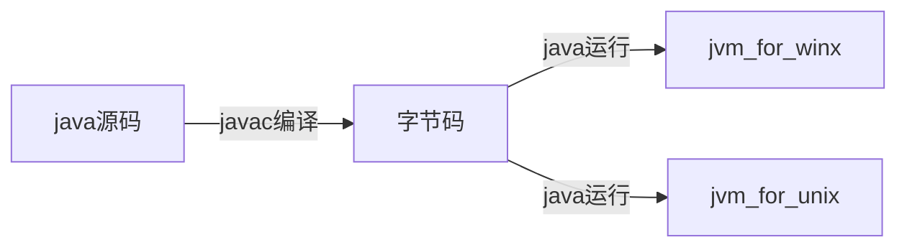

#### 第一次课堂记录

1. 下列不是java语言特点的一项是( C ):
	
	A. 分布式 B.安全性 C.编译执行 D. 面向对象 

	[解析] Java语言用字节码进行解释执行。所以选项C不是Java语言的特点

---

##### java 关键特点
1. 跨平台
	
	编译后的程序可以在window，linux上使用而不用重新编译
2. 不用多层继承
	
	用借口解决多层继承的问题
3. 无goto语句
---
##### java 核心机制
- java虚拟机
- 代码安全性检验
- 垃圾收集机制
---
##### java 编译与运行

字节码与平台无关

---
##### java 运行环境JRE
JRM=JVM+API

JRE运行程序时的三个主要功能
- 加载代码 class loader
- 检验代码bytecoder verifier
- 运行代码runtime interprete

##### java工具使用
java 主要工具：   
- javac:编译
- java：运行控制台和图形界面
- javaw：运行图形界面
- appletViewer 运行applet程序
---
java另外常用几个工具
- jar 打包工具
- javadoc 生成文档
- javap 查看类信息及反汇编  
---
使用jar打包例子
- 编译 javac A.java
- 打包jar cvfm A.jar（生成文件名） A.man（清单信息文件） A.class（这里可以添加几个calss文件）
> c create,v verbose, f filename, m manifest 清单文件
- 运行java -jar A.jar(jar文件其实是zip的压缩文件)

其中A.man标示清单文件，里面包含了一些类的信息，比如主函数是谁，可以任意命名，但常见的是MANIFEST.MF
内容如:  
- Mnifest-Version:1.0
- Class-Path:.
- Main-Class:A
---
使用javaDoc生成文档
- javadoc -d 目录名 xxx.java，作用：自动帮我们提取类信息生成一个html文档，还可以使用特殊的注释标记/** */,还可以使用@+参数标记

---
使用javap
javap 类名 查看类信息
jacap -c 类名 反汇编生成java虚拟机指令

