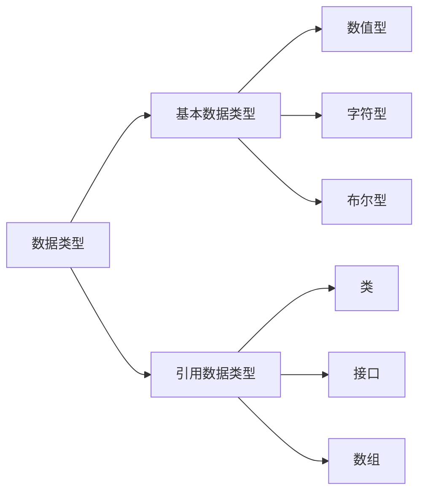

### 3.1 java 数据类型



----

- 逻辑型
	- 不能使用0或非零来代替boolean型，如if(a=5)

- 字符
	- Java编码采用unicode编码，每个字符占两个字节
		- 可用16进制编码表示如 charc1='\u0061'
	- 转义符
\ddd|1-3位八进制数表示的字符
-|-
\uxxxx|1-4位16进制数表示的字符
\r|回车
\f|走纸换行
\b|退格

- 整数型
	- java 二进制写法 0b
	- java没有无符号型
	- java7 可以用千位分割符标示如123_456.789_000
	-  书写规则类名首字母大写，其他包名，方法名，变量名首字母小写（驼峰书写法），少使用_，随定义随用，不要全部写在顶端

### 3.2 算术运算符与表达式
- 运算符
	- 字符串链接符：+
	- >>> 无符号右移，最高位补0
	- 位移运算符的性质
		- 对于int型的操作数会先转换为int在移位
		- 对于int型a>>b现将b对32取模在移位
		- 对于long型先将b对64取模在移位
	- 整型提升：short,byte,char 参与算术运算时会转为int如 byte 型的数加5那么 在加时就变成了int了
### 3.3 java 流程控制语句
- java没有逗号表达式，像x+y;这种语句会报错
- 程序注释/**。。。*/标记注释
- continue 和 break可以加标号表示对某层执行出**某层循环**如默认本层
```java
outer: for(...){
	for(...){
		continue outer;
	}
}

### 3.4 数组
- 声明int[] a,b,c; a,b,c 都是数组，int a[],b,c 只有a是数组
- 不能这样定义 int a[5],因为数组是引用型，需要new
- java有隐式初始化，引用null，数值0，
- 每个数组都有个length来指明大小
- 增强for语句(只读式遍历) 如
```java
int []a=new int[5];
for (int age : ages){
	System.out.println(age);
}
```
复制数组
System.arraycopy 提供了数据元素复制功能
```java
//源数组
int[] source ={1,2,3,4,5,6};
//目的数组
int[] dest = {10,9,8,7,6,5,4,3,2,1};
//复制源数组下标从0开始的source.length个元素到
//目的数组
System.arraycopy(source,0,dest,0,source.Length);
```
> 数组复制的常用方法有4种  
	1. for循环，效率最低  
	2. System.arraycopy() 效率最高  
	3. Arrays.copyOf() 效率次于第二种方法  
	4. Object.clone() 效率次于第二种和第三种  
