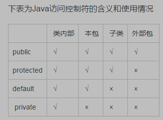

[toc]
### 类与对象
- 封装，继承，多态(不同的对象方法产生不同的结果)

- 面向对象设计思想要点
	- 首先是认为客观世界由各种对象组成的
	- 程序的分析和设计都围绕着：
		- 有那些对象
		- 每个类有哪些属性，方法
		- 类之间的关系（继承，关联）
		- 对象之间发送消息（调用方法）

<mark>方法重载体现了多态</mark>

---
#### 4.1包的定义及使用
##### 4.1包的定义及作用
- 一组类的集合
- 一个包可以包含若干个类文件，还可以包含若干个包
- 包的作用
	- 将相关源代码文件组织在一起
	- 类名的空间管理，利用好包来划分命名空间

##### 4.1.2包的命名
- 独一无二
- java使用小写字母
- 命名方式建议
	- 将机构的Internet域名反序，作为包名前导
	- 含有不可用于标识符的字符用下划线代替
	- 包名中与关键字冲突，用后缀下划线
	- 若开头是违法的用前缀下划线

##### 4.1.3编译单元：
- 一个java源代码文件称为一个编译单元
- 一个编译单元由三个部分组成：
	- 所属包的声明
	- import 包的声明，用于导入外部的类‘
	- 类和接口的声明
- 一个编译单元只能包含一个public类且与文件名相同，其他辅助类编译后也会生成单独的类文件

##### 4.1.4包的声明
- 默认包（未命名的包）
- 不含有包声明的编译单元的默认包的一部风
- 命名包
	- package mypackage；(放在最前面)
- 包与目录
	- 包名与目录名必须对应

##### 4.1.5引入包
- 为了其他包中所提供的类
- 自动引入java.lang
- import 语句格式
	- import packacge1.[package2..].(classname|*);
	- 一定要具体到类名
----
#### 4.2类及成员的访问控制权限
##### 4.2.1类的访问权限控
- 默认的类：同一个包可访问，不同的不能
- public的类：都可以访问

##### 4.2.2类的成员访问权限控制
- 公有（public）
- 保护(protected)其他类不能访问
- 默认(default):继承类，其他类不能访问
- 私有(private):包类，继承类，其他类不能访问

</img>

---

<mark>this 不仅可以调用字段，还可以调用构造方法</mark>

内存分析
- 栈：局部变量
- 堆：new出来的对象
- 方法区（静态区）：代码，static，常量；
---
	
#### 4.3继承
优点:
- 提高复用性
继承的特点：
- 继承后访问权限不变
- 不同包:protected，public
- 相同包:除开private

继承关键字	extends 例如
```java
class Person{
	int age;
	String name;
	void sayHello(){...}
}
class Student extends Persons{
	String school;
	double score;
	void meetTeacher(){...}
}

```
#### object类

- java只支持单继承
- 主要方法
	- getClass()获取当前类的信息
	- toString()返回当前对象本身有关信息的字符串
	- equals()比较两个引用值是否相等


#### final关键字
- final类：不能被继承
- final方法：不允许重写
- 常量
	- 成员变量或局部变量为final就是一个常量相当于c里的const
	- 常量没有默认值，需要自己定义
#### super关键字
- 使用super调用夫类的构造方法
	- 子类不继承父类的构造方法；
	- 子类想使用父类的构造方法
	- 必须是子类构造方法第一调语句
- 使用super可以操作隐藏的成员变量

#### 对象的上转型对象
- 定义的是父类new的是子类

#### 方法重写
- 类似于重载去理解，不需要额外定义关键字，只是冲突了就用本方法的

#### 抽象方法
- 抽象类的方法不一定是抽象方法，有抽象方法的类一定是抽象类
- 抽象方法不能有主体（也没意义）

#### 接口

>描述继承可以描述例如父亲和儿子的关系,而飞机，导弹，篮球，老鹰这种具有共同行为的实物不方便用继承描述它们之间的关系

使用：  
```
interface 接口名 [extends 父接口1，父接口2]
{
	常量定义//总是：public static final;
	方法定义//总是：public abstract; 
	如果不写就默认是以上
}
```

- 实现接口使用implements
- 接口不能创建接口实例，但可以用于声明引用变量类型(接口回调)
- 一个类实现了接口，必须实现接口中所有方法，并且这些方法只能是public
- 接口可以多继承
- 接口里的方法只需要定义就行了,例如 `void function();`

#### 接口和抽象类的区别
- 接口只有常量和抽象方法，没有构造方法等，而抽象类里可以有普通类的所有东西
- 一个类只能继承一个类，一个类可以实现多个接口，接口也可以继承多个接口
- 抽象类里除了private，其他都行，接口里只能public

例子
卡车，出租车都要有刹车功能（必须）
所以定义一个抽象类让他必须实现
其次出租车还要有空调，和收费功能，这时写接口更好（因为java不能多继承
