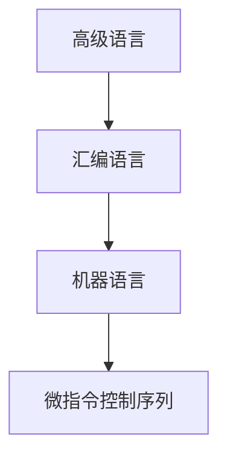

#### 第一章 STC单片机绪论

##### 1.1单片机基础
###### 1.1.1单片机发展历史
单片机:单片微型计算机,微控制器
略
###### 1.1.2 单片机概念
单片-->一块芯片
机-->小型计算机系统
<imt src="../picture/1.1.2.png"></img>

1. 中央处理器:
	- 执行基本操作如:加减,按位操作
	- 地址不同的存储器交换信息
	- 由以下更小的子系统组成
		1. 程序计数器(PC):指向保存下一条程序指令的存储器地址. cpu通过读操作从PC所指向的存储器地址获取具体的指令内容
		2. 指令译码单元(FSM):本质上来说是**有限自动状态机**, 翻译指令内容
		3. 算术逻辑单元(ALU):通过指令译码单元的控制信号,将数据取出送到ALU,然后执行算术或逻辑运算
		4. 控制寄存器和状态寄存器组:控制寄存器组用于设置CPU的工作模式,状态寄存器组反应当前CPU工作状态(异常)
2. 程序存储器
	- 程序存储器的特点:非易失性,程序一旦固化到存储器中,除非重新固化程序到存储器,否则程序将一直保存在程序存储器中,即使断电,
	- Flash工艺,可以多次固化程序,否则一旦写入就不可更改(OTP)
3. 随机访问存储器
	- RAM存储器保存程序需要的变量,在STC单片机中,RAM寻址方式有所不同
4. 中断系统
	- 即当CPU正在执行当前程序是,如果外部设备发出了紧急事件的请求,也就是中断信号,CPU运行立刻打断正在执行的程序
5. 定时器
	- 定时器/计数器, 当定时器到达预先设置的初值是会产生定时器中断信号
6. 外部设备接口模块
	- 与模拟/数字转换器模块相关
7. 总线
	- 总线是相关逻辑信号的集合
	- 对单片机系统来说分两种
		- 内部总线:连接芯片内各个模块单元
		- 外部总线:将外设连接到单片机上
```
术语单片机定义为:单片微型计算机,微控制器
单片机最核心的功能部件为:CPU
存储器分为:程序存储器,随机访问存储器

###### 1.1.3 单片机与嵌入式系统
- 定义:用于控制,监视或者辅助**操作机器和设备**的装置.
- 单片机与嵌入式系统的区别
	- 单片机是物理层面的概念,而嵌入式是系统层面的概念
	- 单片机指没有操作系统的软硬件系统,程序直接运行在硬件系统之上,而嵌入式程序运行在操作系统之上

###### 1.1.4 单片机编程语言特点
单片机特点:
1. 采用存储程序的体系结构, 程序保存在程序存储器中
2. 本质上都是串行执行程序的, 都是靠程序计数器来控制程序的运行
3. 工作在二进制状态,在PC的控制下,通过取出指令,翻译指令和运行指令,运行二进制组成的机器代码

单片机4个语言层次

1. 微控制序列
	- 微控制序列存储在CPU内部. 本质上CPU通过有限状态自动机所构成的微指令控制器对内部的寄存器, 存储器和ALU等参与具体数据处理的功能单元发号施令. 微指令控制序列实际上是数字逻辑中**组合逻辑**和**时序逻辑**层面的概念.
	- 以两个数相加为例子
		1. 选择某个寄存器, 将加数读取出来
		2. 选择另一个寄存器,将被加数读取出来
		3. 将这两个操作数送到ALU
		4. 根据功能选择ALU执行加法运算
		5. ALU产生运算结果和**标志**.如零标志,符号标志, 进位标志和益处标志
		6. 根据指令要求,将结构送到寄存器或者存储器中进行保存.
	- 以上就是一个加法运算要产生的一系列控制序列.这也是通常所说的译码和执行指令
2. 机器语言
	- 对于单片机的应用工程师来说,不需要微控制序列,它只需要告诉CPU执行一条加法运算就行了. 即输入给CPU执行相应操作的0,1序列**称为机器语言.
	- 以下是单片机ACC累加器和各异常数(立即数)相加的机器语言的格式. 由0,1构成的序列,包括操作码个操作数两部分
$$0 0 |1 0 | 0 1 0 0| 立即数$$
	- 操作码:告诉CPU需要执行的操作.如上$(00100100)_2)$ . 操作吗包括:操作类型编码,一部分操作数内容, 指明参加加法运算的一个数来自ACC累加器
	- 操作数:指操作的对象,包括立即数(常数),寄存器和存储器. 立即数占用了8个比特位, 表示参加加法的另一个数, 有具体取之确定
3. 汇编语言
	- 汇编语言记住符指令通过汇编器翻译成机器语言指令. 汇编记住符描述机器指令完整格式:  [标号: ]  助记符 [操作数] [;注释]
		- 例如 ADD A, #25 :ADD表示数据相加, A表示目的操作数, 即ACC累加器, #25表示源操作数. 翻译过来就是将立即数25和ACC累加器内保存的数相加, 并加结果保存在ACC累加器中
	- 汇编语言相对高级语言来说,汇编语言还是需要程序源清楚CPU指令集, 寄存器单元和存储器映射等硬件规则. 虽然执行效率高, 但编程效率依然很低
	- 汇编语言重要的几点: 理解COU的结构和运行原理, 一些直接和CPU打交道的驱动程序必须用汇编语言开发
4. 高级语言
	- 以C语言为代表

---
c语言,汇编语言个机器语言之间的关系
c语言描述|汇编语言描述|机器语言描述|功能
-|-|-|
F=C+D|MOV A, 0x08<br>ADD A,0x09<br>MOV 0x0A, A|E508<br>2509<br>F50A|将数据空间地址为0x08单元的内容送给累加器ACC<br>将数据空间地址为0x09单元的内容和累加器ACC相加后送给累加器ACC<br>将累加器ACC的内容送到地址0x0A的单元中

#### 1.2 STC单片机简介

##### 1.2.1 STC单片机发展史
##### 1.2.2 STC单片机IAP和ISP
- 对于程序存储器采用Flash工艺时, 运行设计者重复固化程序到程序存储器. 这个过程分两种
	1. ISP: 提供专用串行编程接口和STC提供专用串口下载器固化程序软件, 对单片机内部的Flash存储器进行编程
	2. IAP: 将Flash存储器映射为两个存储空间, 当运行一个存储空间内的用户程序时, 该程序可以将另外一个存储空间进行重新编程
	- $ISP \in IAP$ 前缀为STC的单片机不支持IAP, 前缀为IAP的单片机支持IAP
- STC单片机命名规则: xxx 15 x x xx $x^{--}$ xx x -xxx x 
	1. STC,IAP,IRC
		- STC :不可以用用户区程序Flash作为EEPROM使用,有专门的EEPROM
		- IAP :可以用用户程序区的程序Flash作为EEPROM使用
		- IRC : 可以用用户程序区的程序Flash作为EEPROM使用, 且固定使用内部的24MHz时钟
	2. 12,15. 表示是那个系列的产品
	3. F,L,M表示单片机不同的工作电压
		- F Flash 工作电压范围在3.8~5.5V
		- L 表示低电压, 2.4~3.6V
		- W 宽电压, 2.5~5.5V
	4. 标识单片机SRAM存储空间容量
		- 一位数字时以128byte为单位
		- 超过1KB时,例如用1K,单位是byte
	5. 单片机内程序空间大小. 例如01 1KB, 24 24KB
	6. 表示单片机的一些特殊功能,用W,S,AS,PWM,AD,S4表示. 
		- W 有掉电唤醒专用定时器
		- S 表示有串口
		- AS/PWM/AS表示有1组高速异步串行通信接口;SPI功能;内部EEPROM功能;A/D转换功能,CCP/PWM/PCA功能.
		- S4表示有4组高速异步串行通信接口;SPI功能;内部EEPROM功能;A/D转换功能,CCP/PWM/PCA功能.
	7. 单片机工作频率, 28 表示28MHz
	8. 工作温度范围
		- C 表示商业级,工作范围0~70C
		- I表示工业级, -40~85C
	9. 表示单片机封装类型, LQEP,PDIP,SOP,SKDIP,QFN
	10. 表示单片机引脚个数, 如64,48,44,40,32,28
####  1.3
- .lst 对应文件在编译器中的行号
- .lnp 对应项目 包含了什么文件, 生成什么文件信息
- 无后缀文件 这个是最终生成的文件
- .obj 编译器生成的目标文件
- .m51 用文本编辑器打开可以看到一些信息(调试用)

