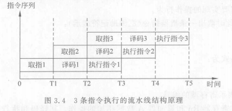

#### 3 STC单片机CPU子系统
##### 3.1 STC单片机CPU内核功能单元
- 单片机的五个子系统:运算器,控制器,存储器,外设和时钟系统
- 运算器和控制器构成了CPU
- 总线:一组逻辑信号的集合.  包括数据信号, 地址信号和控制信号(三总线结构), 之所以称为8位单片机是因为单片机数据信号是8位的
</img>
- 大多数指令使用1或2个时钟周期执行
- 256字节的内部数据RAM
###### 3.1.1 控制器
> 控制CPU内各个组件协调工作

1 程序计数器
> 程序计数器可以源源不断的从程序存储器中取出要执行的指令, 每次都指向下一条要执行的指令的地址空间
程序计数器宽度16位, 也就是地址深度$2^{16}$, 即64KB-->意义:机器代码 长度不超过64KB
程序计数器可以分:顺序执行,非属性执行--》程序地址寄存器不一定是递增的

1. 顺序执行:即一次递增
2. 非顺序执行:程序中有跳转, 判断等语句时就需要将指令跳转到某一条指令

2 指令通道
> 指令通道包括取指单元, 译码单元,执行指令单元. 执行这3个的过程就是一个有限自动机, 也就是微指令控制器
-  程序存储器宽度为8, 而机器指令有8, 16, 24 等不同. 所以取指花费的时间也不同

- 以(汇编)ADD A, Rn 为例(机器指令为: 0010 1rrr. rrr表示寄存器编号)
	1. 从Rn中取出数据送到ALU的一个输入端口TMP1 (Rn)->(TMP2)
	2. 从累加器ACC取数据送入ALU的另一个输入端口TMP2 (ACC)->(TMP2)
	3. 将TMP1和TMP2的数据送到ALU进行相加, 产生结果 (TMP2)+(TMP1)->(总线)
	4. 将ALU产生结果通过总线送入ACC累加器 (总线)->(ACC)
3. 流水线技术
> 这个技术就是指令通道改进流水线技术, 尽可能减少3个单元等, 如图:
</img>
- 分两种:
	- 二级流水线结构:将译码和执行指令看在一起
	- 三级流水线结构:----分开看
4. 双指针
> 双数据指针(dual data potinter, DPTR) 是16位专用寄存器, 有(DPL)低8位和DPH(高八位)组成, 地址位82H和83H.唯一可以直接进行16位操作的寄存器, 也可以分别对DPH和DPL进行操作
- 如果没有外部数据总线, 则只有一个DPTR, 否则有两个DPTR
- 通过设置SFR中的P_SW1 来选择那个DPTR
</img>
5. 堆栈和指针
> SP的内容就是栈顶在RAM中的地址
- 典型的一个功能是当遇到跳转指令时就需要SP来保存下一个指令, 当跳转完时在恢复保存的指令
- 注意SP的内容初始化位07H, 所以是从08H开始存储的, 但08H属于工作寄存器组, 所以最好自己定义从80H开始.
- SP 地址是0x81

###### 3.1.2 运算器
> CPU内的运算器包括 8位算术逻辑单元, 累加器, B寄存器, 程序状态字

1. 8位算术逻辑单元(ALU)
功能包括算术运算(加减乘除), 其他运算(递增, 递减,BCD十进制调整和比较运算), 逻辑运算, 按位运算(置位, 复位, 取补)
2. 累加器
> accumulator, ACC 简称A, 保存大多数运算结果的寄存器. 位于SFR0xE0
3. B寄存器
>位于SFR 0xF0
	1. 乘法: 乘法的一个操作数保存在B寄存器中, 另一个保存在A寄存器中, 结果的高八位保存在B寄存器中, 低八位保存在A寄存器中国
	2. 除法: 被除数保存在A寄存器中, 除数保存着B寄存器中. 商保存在A寄存器中, 余数保存在B寄存器中
4. 程序状态字(PSW)
比特位|7|6|5|4|3|2|1|0
-|-|-|-|-|-|-|-
名字|CY|AC|F0|RS1|RS0|OV|RSV|P
	1. CY: 进位标志. 算术和位指令影响该位.  加法时有进位, 减法时有借位 CY位1, 否则位0
	2. AC 辅助进位标志. ADD, ADDC, SUBB指令影响该位, 加法运算第3位或第4位有进位, 减法运算第3位或第4位有借位. 目的方便BCD码加法, 减法的调整
	3. F0: 通用标志 位
	4. RS1, RS0: 寄存器组选择位
	5. OV: 溢出标志位. ADD, ADDC, SUBB, MUL, DIV 影响该位
	6. RSV 保留位
	7. P 奇偶标志位. **每条指令执行完后设置或清除该位**, 用于表示ACC中1的个数. 如果有奇数个1 设置为1; 构造为0
###### 3.1.3 特殊功能寄存器(SFR)
> 有特殊功能的RAM区域, 对单片机各个功能模块进行管理,控制监视. 注意因为和RAM高八位地址重合, 所以用直接寻址寻SFR, 特殊功能寄存器中能被8整除的可以进行位寻址
1. 端口控制器组: 提供了控制每个端口的控制寄存器
	- P0 端口寄存器组:P0寄存器, P0M0寄存器,P0M1寄存器.

#### 3.2 STC单片机存储空间和地址空间
>介绍包括: Flash存储器, 内部RAM存储器和外部数据存储器
##### 3.2.1程序Flash存储器

##### 3.2.2数据Flash存储器

##### 3.2.3 内部数据RAM存储器

##### 3.2.3 外部数据存储器

#### 3.3 STC单片机中断系统原理及功能

#### 3.3.1中断原理
过程:
1. 外设在中断线上产生脉冲, 中断控制器设置中断标志, 并向CPU发出请求
2. CPU响应并开始执行中断服务程序(ISR), 中断控制器在进入ISR时,清楚中断标志
3. CPU从中断返回
中断类型:
1. 外部中断:$\overline{INT0}, \overline{INT1};P3.2,P3.3$
2. 内部中断:Timer0(T0定时/计数), Timer1;非周期性(只能计数),周期性(可以定时和计数);P3.4,P3.5
3. 串口中断:UART1(RxD/TxD);P3.0,P3.1
相关寄存器说明:
1. IE寄存器(地址:0xA8; 复位值:00000000B)
	0. EX0:外部中断0允许位; 1允许
	1. ET0:定时/计数器T0的溢出中断允许位; 1允许T0溢出产生中断事件
	2. EX1:外部中断1允许位
	3. ET1:定时/计数器T1的溢出中断允许位
	4. ES:串行接口1中断允许位
	5. EADC:ADC转换中断允许位
	6. ELVD:低电压检测中断允许位
	7. EA:全局中断使能位
