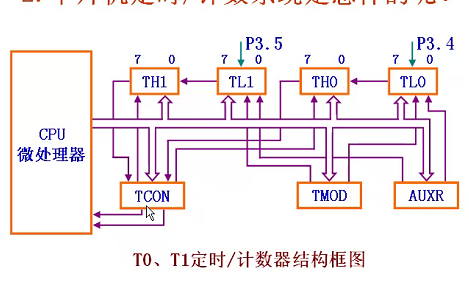
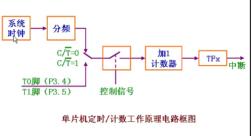

</img>
</img>

$1兆等于10^{12};10^{12}秒=1微秒$

加数器计满后向TRx进位,然后TRx判断是否产生中断

TMOD,TCON和AUXR(标准51没有)特殊功能寄存器:
- TMOD(地址89H,复位置00-00H):设置工作方式
	- M0,M1:工作方式选位
	- C/T\`: 定时(0)或计数功能(1)的选择位
	- GATE: 启动和停止定时计数的门控位
	- 低4位控制T0, 高4位控制T1
		- 启动T0:GATE=0, TR0=1或GATE=1,TR0=1,INT0=1
		- 启动T1:

M1|M0|工作方式|功能说明
-|-|-|-
0|0|方式0|13位定时计数
0|1|方式1|16位定时计数器
1|0|方式2|8位自动重装初始值的定时计数器
1|1|方式3|T0:分为两个8位定时计数器<\br>定时器1:停止计数
以a开始计数时间:
$$t=\frac{12}{f_{osc}}*(2^{13}-a)\mu s$$
公式推到过程:  
$f_{osc} -> \frac{1}{f_{osc}}(s) -> \frac{1}{f`_{osc}}(\mu s) -> \frac{12}{f`_{osc}}(s^{13}-a)(\mu s)$
- TCON(地址88H,00-00H):
	- TF0: 定时计数器0 溢出标识位
	- TR0: 定时计数器0允许控制位
		- GATE=0时, TR0置1即可启动定时计数器0
		- GATE=1时, TR0置1且INT0输入引脚信号位高电平时启动定时计数器0
- RCON:控制寄存器

定时器使用过程:
- 确定工作方式:对TMOD赋值(T0,T1的GATR,C/T,M1,M0)
- 预置定时或计数的初值: 可直接写到TH0,TL0,TH1,TL1
- 根据需要开放定时器/计数器的中断TCON: 直接对对应的IE赋值(ET0,ET1,EA)
- 启动定时器: TR0,TR1等

