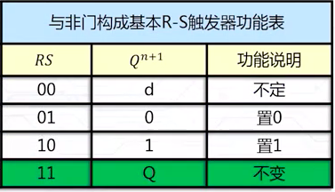
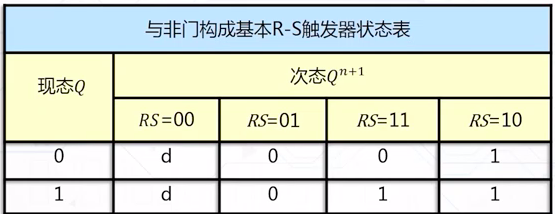
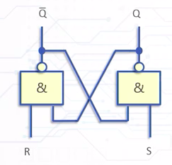
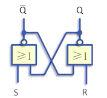
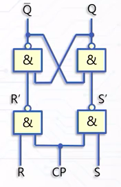
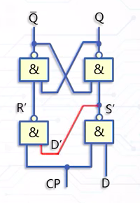
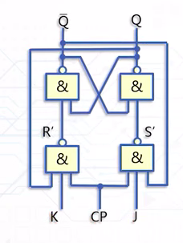

> 双稳态触发器是能够存储一位二进制码的逻辑电路元件

- 触发器结构:
	- 两个互补输出端,Q,$bar_{Q}$
	- 两个稳定状态1和0, 
	- 输入信号不发生改变时 触发器状态稳定不变
	- 在一定的输入信号作用下, 触发器可以从一个稳定装套到另一个稳定状态转移, 输入信号撤销后状态不变
- 现态(现在的状态),次态(改变后的状态): $Q^n, bar_{Q^n}$, $Q^_{n+1}, bar_{Q^{n+1}}$
- 锁存器和触发器:
	- 相同点:都是存0,1两种状态
	- 不同点: 锁存器对脉冲电平敏感, 触发器对脉冲边沿敏感
- 触发器的描述:
	- 功能表: 如图
	</img>
	- 激励表:反映了从现态转移到某种状态,**触发器**对输入信号的要求
	</img>
	- 状态表:反应了输入作用下现态和次态的转移关系
	</img>
	- 状态图;反应了输入作用下现态和次态的转移关系的有向图
	- 卡诺图:根据功能或者状态表得到卡诺图, 卡诺图化简得到次态方程
	- 次态方程,约束方程
----

##### 5.1RS触发器
与非门构成的触发器:
</img>
- 分析: RS与非有4种情况
	1. 00: 两个输出端同时为1, 违反了互补的设计, 所以设置约束方程限制
	2. 01: 清0
	3. 11: 保持原来状态
	4. 10: 置1
	- 特征方程：$Q^{n+1}=\bar{S}+RQ^n$
	- 约束方程：$R+S=1$

或非门构成的触发器:
</img>
- 分析:
	1. 00: 不变
	2. 01 置1
	3. 11 不定
	4. 10 置0

- 特征方程: $Q^{n+1}=S+\bar{R}Q^n$  
- 约束方程: $S·R=0$
- 优点: 结构简单, 可作为记忆元件独立使用, 可以作为其他触发器的基本组成部分
- 缺点: R, S具有约束关系, 不能进行定时控制, 使用一定限制

##### 5.2时钟控制触发器
- 由时钟脉冲确定状态转换的时刻
- 输入信号确定触发器状态转换的方向
----
钟控R-S触发器
</img>
- 当CP=0时:原来状态不变
- 当CP=1时:功能和与非门相同  

特征方程  
$Q^{n+1}=S+\bar{R}Q^n$  
$S·R=0$
>钟控R-S触发器虽然有了时钟控制, 但还是有约束条件, 因此改进得到D触发器

----
钟控D触发器(锁存器)
</img>
特征方程  
$Q^{n+1}=D$
>因为输入端看一看作R,S互补所以不存在约束问题了
- 当cp=0时:保持原来状态不变
- 当cp=1时: D是什么输出端就是什么, D=0时就是清0, D=1就是置1
>缺点是功能太少了, 所以改进成了J-K触发器

---
钟控JK触发器
</img>

$Q^{n+1}=J\bar{Q^{n}}+\bar{K}Q^n$
- 分析:
	1. 00:不变
	2. 01:置0
	3. 10:置1
	4. 11:翻转

---
T触发器(将j和K连在一起)  
</img>
- 特征方程: $Q^{n+1}=T \oplus Q^{n}$
- 分析: 
	- 0: 不变
	- 1: 翻转
- T\`触发器(功能):二分频
---
#####  主从触发器
> 电位触发器可能会出现空翻现象, 就是在一个脉冲下多次变化
解决方法是变成两个触发器复合在一起, 并且时钟端是相反的, 这样两个触发器不可能同时工作, 只有在边沿才可以工作
</img>
##### 5.3 D触发器功能转换
D触发器构成JK触发器
k

