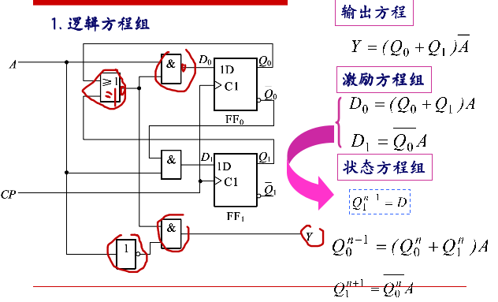
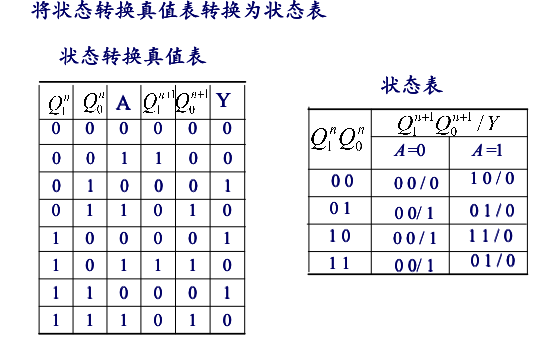
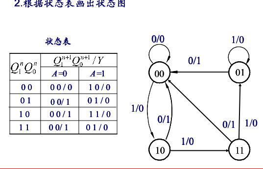
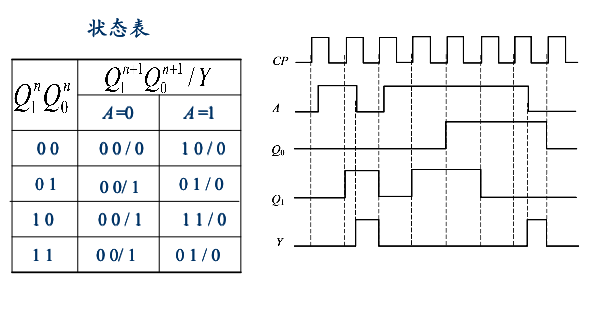

### 时序逻辑电路
特点:电路由组合电路和存储电路组成, 电路存在反馈

#### 时序逻辑电路分析
逻辑方程:
- 输出方程: $O=f_1(I,S)$ . 输出信号和输入信号, 状态变量的关系式
- 激励方程: $E=f_3(E,S^n)$. 激励信号和输入信号, 状态变量的关系
- 状态方程: $S^{n+1}=f_3(E,S^n)$. 现态到次态的转换关系式
</img>
根据方程组列出状态转换真值表:
</img>
将状态转换真值表转换为状态表:
</img>
根据状态表画出状态图:
</img>
电路的工作方式划分:
</img>

#### 时序逻辑电路的设计
- 根据逻辑功能建立状态图
	- 确定输入变量和符号
	- 找出状态和状态间的转换关系
	- 根据原始状态图建立原始状态表
- 状态化简
	- 合并等价状态
	- 等价状态: 相同输入,输出并且转换到同一次态
- 状态分配
- 选择触发器
- 确定激励方程组和输出方程组
- 画出逻辑图并检查自启动

例子:
- 用D触发器设计一个8421BCD码同步十进制加计数器
- 设计一个串行数据检测器, 输入信号X与时钟脉冲同步, 输入信号为Z, 要求输入为110时,输出1, 否则输出0

