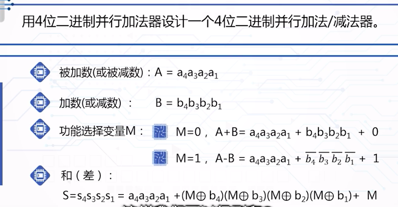
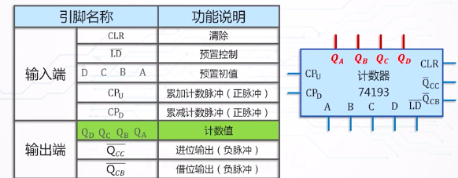
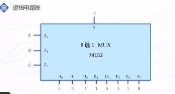
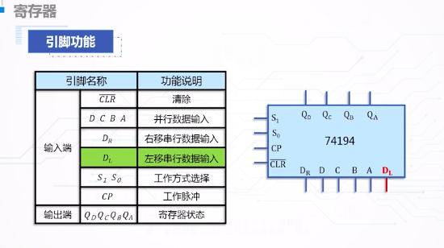
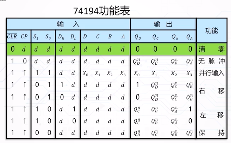

#### 绪论
目的
1. 认识常用中规模通用集成点了的逻辑符号, 基本逻辑功能, 外部特性和使用方法
2. 应用常用中规模通用集成点了作为基本不见完成各种逻辑电路的设计
3. 常用中规模信号产生与变换电路的分析与设计

常用中规模组合逻辑电路: 加法器,编码器, 译码器, 多路选择器, 多路分配器

常用中规模组合逻辑电路
- 二进制并行加法器
	- 串行进位二进制并行加法器
		- 例如8+1+3:用前面说过的全加器实现只需要串联起来就行了
		- 缺点速度太慢
	- (改进)超前进位二进制并行加法器
		- 将进位用前面的AB表示这样就不用等待了
		- 典型的是74LS283
		- 例如用4位二进制加法器设计一个4位二进制并行减法器
		- 设计一个用余3码表示的1位10进制数加法器:注意余3码的意义-->进位加3, 无进位减3
	- 应用:
		- 二进制加法运算
		- 二进制减法运算: 减法是A加B的补, 补是取非加一, 所以也能用加法实现. **有个小技巧, 就是通过一位M, 来控制是否取非, 用M异或上B的每一位, 根据M取0 还是1决定,Bi是原变量还是反变量, 最后在加上M. 就实现了由M控制B是不是取补了(减法)**
		</img>
		- 二进制乘法运算
		- 十进制加法运算
		- 代码转化
- 译码器和编码器
	- 译码器:能将n个输入变量变换成$2^n$个输出函数, 且输出函数于输入变量构成的最小项具有对应关系的一种多输入多输出组合逻辑电路
		- 对具有特定含义的输入代码进行翻译
		- 种类:
			- 二进制译码器
			- 二-十进制译码器
			- 数字显示器
		- 特点:
			- 输入端:n
			- 输出端:$2^n$
			- 使能端一个或多个
			- 使能输入端为有效电平时,对应每一种输入代码,仅一个输入端为有效电平, 其余输出端为无效电平
		- 典型的译码器:
			- 2-4线译码器2输入4输出
			- 3-8线译码器
			- 4-16线译码器
		- 二进制译码器74138(低电平有效)
		</img>
		- 二十进制译码器
			- 功能:将4为BCD码的10组代码翻译成10个与十进制数字符号对应的输出信号
			- 常用的芯片7442
		- 数字显示译码器:
			- 驱动显示器件如荧光数码管,液晶屏数码管, 将代码转换成相应数字, 并且显示出来
			- 如 7段,8段数码管
			- 常见的74LS47
	- 编码器:对输入信号按一定规律进行编排, 使得每组输出代码都有特定的含义
		- 种类:
			- 二- 十进制编码器(十进制BCD码编码器)
			- 优先编码器
		- 二- 十进制编码器
			- 功能: 将十进制数字0-9分别编码成4为BCD码
			- 输入信号十互斥的
			- 例如按键式8421码编码器结构, 缺点是不能同时按下2个或2个以上的按键
		- 优先编码: 识别信号优先级别最高的一个进行编码
			- 典型芯片:74LS148
			- 下标越大优先级越高
			- 有效工作电平都是低电平
- 多路选择器和多路分配器
	- 多路选择器(MUX) 多条输入中选某一路送至输出端
	- 输出对输入的选择受选择控制量控制
	- 通常$2^n$哥输入和一路输出的多路选择器有n哥选择控制变量
	- 控制变量的每种取之组合对应选中一路输入送到输出
	- 典型芯片:4,8,16路选择器, 四路典型的有74153, 8路74LS151
	</img>
	- 数据分配器:与数据选择器相反
	- 用74HC138组成分配器

常用中规模时序逻辑电路
- 计数器:
	- 按工作方式分为: 同步计数器, 异步计数器
	- 按进制位分: 二进制计数器, 十进制计数器...
	- 功能分: 加法计数器, 减法计数器.
	- 计数器的功能: 计数,保存, 清楚, 预置
	- 典型74193
		- 4位二进制同步可逆计数器
		- 功能:清除, 预置, 累加计数, 累减计数
		</img>
		- 异步置位,异步清0 (异步操作会出现一个暂态, 例如1010 连接清0端, 如果是异步的话一出现1010就直接清0 显示器捕捉不到, 如果是同步, 那么还要等一个时钟信号才会清0 显示器可以捕捉,所以以5进制为例, 同步的信号连接0100, 异步的信号连接0101)
	- 集成异步计数器74290
		- 二一五十进制加法计数器
		- 四个JK触发器构成:触发器0 是模2计数, 后面3个组成模5计数. 分别由CPA, CPB 控制那种方式
		- 只有6个输入口和4个输出口, 输入口:R9A R9B, R0A R0B 两两一组. 当一组中全为1时置位9(或0, R9 组优先级高).  所以这里的输出端不能设置任意初值
		- 可以用一块74290设计8421码或者5421码的10进制计数器
- 寄存器:
	- 存放数据或者运算结果的一种逻辑部件
	- 功能:
		- 接收数据, 保存数据和传送数据
		- 左右移位
		- 串并输入
		- 串并输出
		- 预置, 清零
	- 典型74194
		- 4位双向移位寄存器 
		</img>
		</img>
		- 例子:
			- 用74194设计一个8位计数器
			- 用74194设计适当的逻辑吗构成产生序列01110100的序列发生器
			
常用中规模信号产生与变换电路
