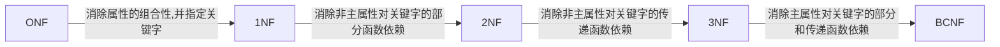

#### 规范化概念
问题引入:
1. 假设一个关系包含:学号,姓名,年龄,性别,系,系主任,课程号,成绩
2. 导致的问题:
	- 冗余大
	- 插入异常
	- 删除异常
	- 根性异常
3. 原因:由于模式中的某些数据依赖引起的
4. 解决方法:通过分解关系模式来消除其中不适合的数据依赖

- **数据依赖**是各个属性间的关联, 包括函数依赖, 多值依赖和连接依赖

#### 数据依赖

- 函数依赖:设R(U)是属性集U上的关系模式. X, Y是U的子集. 对于x的每个具体值, y都有唯一的值与之对于, 则称“X函数决定Y”或“Y函数依赖于X”,称x为决定因子,Y是依赖因子,X-->Y为模式R(U)的一个函数依赖
	- 如 学号-->姓名, 系-->系主任
	介绍一些术语:
	- 若x-->y, 但$Y \notin X$ 则称X-->Y是**非平凡的函数依赖** 
	- 若x-->Y, 但$Y \in X$ 则称x-->Y是**平凡的函数依赖** 
- 在R(U)中,如果X-->Y, 并且对于X的任何一个真子集X'都有X'-\\->Y, 则称Y**完全函数依赖**于X, 记作X-F->Y.
- 反过来如果存在某个真子集成立,则称**部分函数依赖**于X,记作:X-P->Y
- 在R(U)中,如果X-->Y, ($Y \notin X$), Y-\->X, Y-->Z, 则称Z**传递函数依赖**于X,记作X-传递->Z.
---
- 在R(U)中, U是R的全部属性集合, $K \in U$是一个属性或是一个属性组合. 若K-->U, 则K为R的**候选码**. 若候选码多余一个, 则选对其中的一个作为**主码**. 即K-->U, 且不存在任何$K' \in K$使得K'-->U成立
	- **主属性**:包含任何一个候选码中的属性.
	- **非主属性**:不包含任何一个码中的属性.
---
#### 范式
1. 有关系模式R(U), 其中所有的属性都是不可分的基本数据项,则称R属于**第一范式**,简称1NF(任何一个数据库系统都应该满足)
2. 设有关系模式$R(U) \in 1NF$, 如果所有非主属性都完全函数依赖于码,则称R属于**第二范式**,简称2NF, 记作$R \in 2NF$
3.  设有关系模式$R(U) \in 2NF$, 如果其所有非主属性都不传递函数依赖于码, 则称R属于**第三范式**, 简称3NF, 记作$R \in 3NF$
4. 设有关系模式$R(U) \in 3NF$, 如果其所有**主属性**都不部分和传递依赖于码, 则称R属于**BCNF范式**, 记作$R \in BCNF$.
	- 注意BCNF是一个较为理想的关系模式. 并不是规范化程度越高,模式越好

关系模式的规范化过程:

